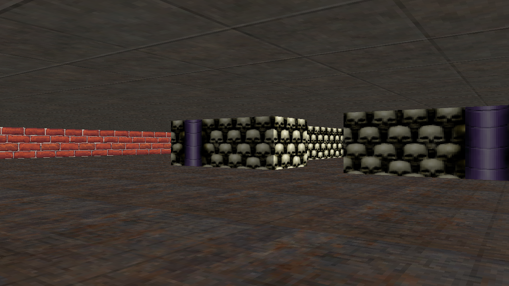
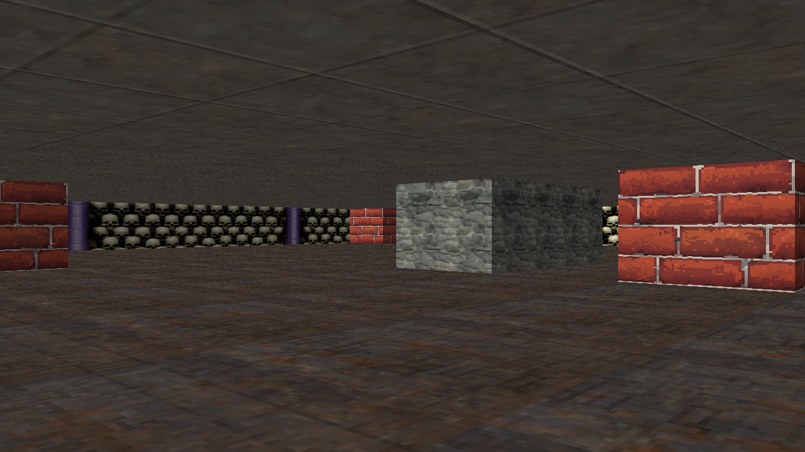
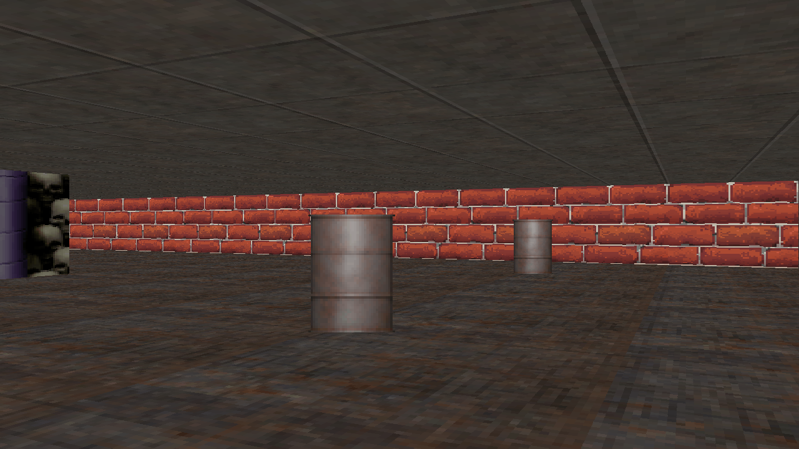

# Raycaster
***
Textured raycaster made in C++ with SDL2, akin to Wolfenstein 3D.

## Features
***
* Textured walls
* Textured floors and ceilings
* Billboard sprite rendering
* External texture and map loading

## Controls
***
`W`, `A`, `S`, and `D` to move around <br><br>
`Left arrow` and `Right arrow` to look around <br><br>
`Up arrow` to load the next map <br><br>
`Down arrow` to load the last map <br><br>

## Credits
***

#### Teaching me about raycasters

* [lodev](https://lodev.org/cgtutor/raycasting.html)

#### Textures are from [opengameart](https://opengameart.org)

* [metal_ceiling.png (4-light-grey-metal-plates)](https://opengameart.org/content/4-light-grey-metal-plates) by Georges "TRaK" Grondin <br>
* [metal.png (rusty metal floor)](https://opengameart.org/content/rusty-metal-floor-texture) by Sindwiller <br>
* [bone_wall.png & bone_wall_pillar.png](https://opengameart.org/content/skull-wall) by p0ss <br>
* [bricks.png](https://opengameart.org/content/bricks-tiled-texture-64x64) by alpha_rats<br>
* [stonewall.png](https://opengameart.org/node/8041) by West:

## Screenshots
***




## Requirements
***
This project requires:

* SDL2

## Compiling
***
This project uses CMake. Run 
```
cmake CMakeLists.txt
```
